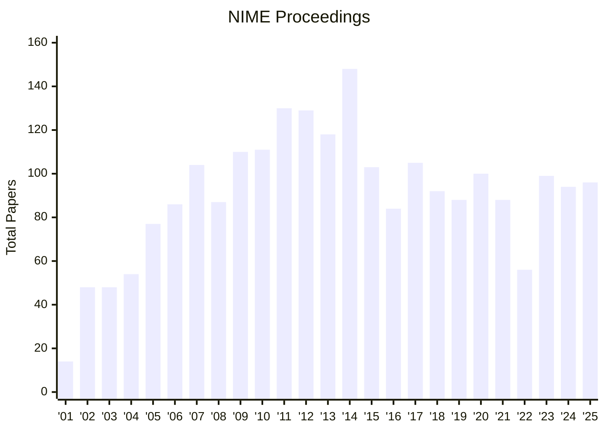
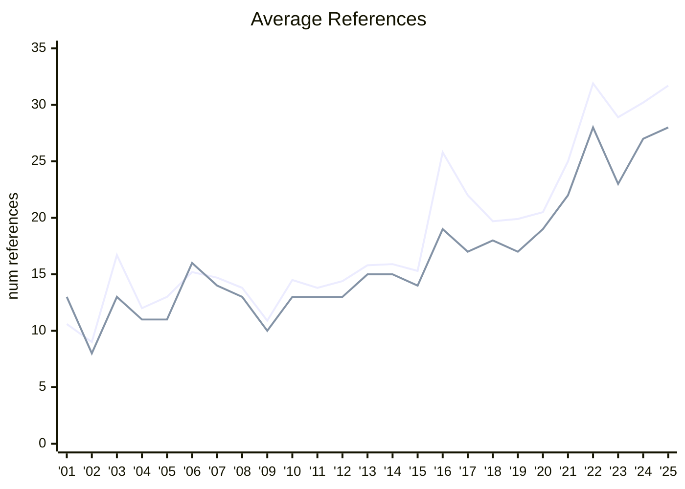

# "See Link for More Details": Towards a Pragmatic Open Methodology at NIME
[](https://doi.org/10.5281/zenodo.19443616)

- ["See Link for More Details": Towards a Pragmatic Open Methodology at NIME](#see-link-for-more-details-towards-a-pragmatic-open-methodology-at-nime)
  - [Abstract](#abstract)
  - [Important Dates:](#important-dates)
  - [Data](#data)
    - [NIME 2025 Zenodo Archives with Additional Files](#nime-2025-zenodo-archives-with-additional-files)
  - [Audit](#audit)
    - [Download NIME papers](#download-nime-papers)
    - [Grepping](#grepping)
    - [Searching for URLs](#searching-for-urls)
      - [Prune Search](#prune-search)
        - [Remove false positives and obvious references](#remove-false-positives-and-obvious-references)
        - [Remove false positives](#remove-false-positives)
      - [Finding Source Repositories](#finding-source-repositories)
      - [General Git References Count](#general-git-references-count)
        - [Git URLs %  (pruned)](#git-urls---pruned)
        - [Git URLs % (pruned) no github.io](#git-urls--pruned-no-githubio)
        - [Git URLs count (pruned)](#git-urls-count-pruned)
        - [GitHub term use %](#github-term-use-)
        - [GitHub term use % (no github.io)](#github-term-use--no-githubio)
        - [github.io use %](#githubio-use-)
        - [Open Source term use %](#open-source-term-use-)
        - [Git term use count](#git-term-use-count)
        - [Git and SourceForge count](#git-and-sourceforge-count)
        - [SourceForge only count](#sourceforge-only-count)
        - [Total Reference per year / paper](#total-reference-per-year--paper)
        - [Exclusive Github](#exclusive-github)
        - [Count NIME Papers](#count-nime-papers)
    - [Reference Counting](#reference-counting)
      - [List reference](#list-reference)
      - [Count references](#count-references)
  - [NIME Stats](#nime-stats)
    - [Number of Papers](#number-of-papers)
    - [Average Number of References per Paper](#average-number-of-references-per-paper)
  - [Lessons Learned](#lessons-learned)
    - [Recommendations](#recommendations)


## Abstract

Since its inception, NIME has been committed to open research, with a strong tradition of open source practice running through its history. In the context of the NIME 2026 theme of communities, this paper examines current open research practices at NIME and explores how they might be developed to better engage a new generation of creators beyond the conference itself.
Through an analysis of NIME 2025 proceedings, we assess how source materials—including software, hardware designs, data, and documentation—are shared, discovered, and cited. The analysis reveals a growing familiarity with open source tools, alongside persistent barriers to discoverability, reuse, and long-term access.
Drawing on the documentation and dissemination process of a recent NIME, the paper outlines a deliberate and visible open methodology that treats Digital Musical Interfaces as evolving, reusable research objects for a wider community rather than closed artefacts tied solely to a publication. 
The paper concludes by reflecting on current limitations and proposes practical ways to lower barriers to reusing and recreating NIMEs, framing ``good-enough'' open research as a catalyst for further participation, knowledge exchange, and impact beyond the current NIME community.

## Important Dates:
All dates are 23:59 AoE (Anywhere on Earth).

- [x] 4 December 2025: Submission CMT Site opens
- [x] 5 February 2026: Papers and Music - Titles, abstracts and author lists due
- [x] 12 February 2026: Papers and Music - Final submissions due
- [x] 5 March 2026: Workshop, alt.NIME and Student Consortium submissions due
- [x] 3 April 2026: Acceptance decisions and reviews released
- [ ] 30 April 2026: Camera ready and presenter registration deadline
- [ ] 23 June 2026: NIME Workshops and Student Consortium
- [ ] 24-26 June 2026: NIME Conference

## Data

See [`./data`](./data) directory for set of `.csv` and markdown tables listing papers, their repos and the link context.

> [!NOTE]
> **Data Format**
>
> The "placement" field for the repository data referes to where in the paper the link was shared. In some cases there is an additional value in round braces denoting if the link was shared using link shortening, a hyperlink (obfuscating the URL from text search) or `missing`. In the `missing` case, this typically means that the URL leads to some kind of server error or to an authentication page. For the `data/cite-methods.csv` "missing" takes precedence e.g., `footnote (missing)` would be counted as `missing` not as `footnote`.
>
> The data is also not fully standardised. Originally there was an `inferred` category for extant repositories that were not in the paper. Instead this is should now be consolidated into the `missing` category.
>
> For instances where the source material link is shared more than once, a semicolon is used to delimit.
>
> `reference` and `citation` have been used interchangeably. This will be consolidated into `citation` in a future update.

### NIME 2025 Zenodo Archives with Additional Files

All additional files are video

- https://zenodo.org/records/15699550
- https://zenodo.org/records/15699591
- https://zenodo.org/records/15699598
- https://zenodo.org/records/15699614
- https://zenodo.org/records/15699626
- https://zenodo.org/records/15699633
- https://zenodo.org/records/15699645
- https://zenodo.org/records/15699652
- https://zenodo.org/records/15698912
- https://zenodo.org/records/15699656
- https://zenodo.org/records/15698936
- https://zenodo.org/records/15699662
- https://zenodo.org/records/15698970
- https://zenodo.org/records/15698972
- https://zenodo.org/records/15698986
- https://zenodo.org/records/15699671

## Audit

Below are a collection of script snippets and notes used for analysing the NIME proceedings archive.

### Download NIME papers

>[!NOTE]
> NIME 2021 and 2022 are a little more involved to pull the pdfs.
> You ~can~ could `curl` a PubPub article with 
> 
> ```
> https://nime.pubpub.org/pub/<PAPER_ID>/download/pdf
> ```
>
> This is currently broken. Pulling pdfs for these years will require another approach.
> Potentially the URLs can be openened in a web browser programtically and then transferred afterwards. 
> You will need to prep your download location first.


```sh
for year in {2001..2025}; do  
  mkdir "${year}"
  for paper in $(curl "https://raw.githubusercontent.com/NIME-conference/NIME-bibliography/refs/heads/master/paper_proceedings/nime${year}.bib"| grep -E "url\s+=\s+{" | grep -o -E "http.*"); do    
  paper="${paper:0:-2}"
  [[ $paper != https://* ]] && paper="https${paper:4}"    
    if [[ ${paper} == *"pubpub"* ]]; then
      curl "${paper}/download/pdf" -o "${paper:28}.pdf" --output-dir "${year}"
    elif [[ ${paper} == *"doi.org"* ]]; then         
      paperurl="$(curl -s ${paper} | grep -m 1 -o -E "https://nime.pubpub.org/pub/\w+" | tail -1)/download/pdf" 
      curl "${paperurl}" -o "${paperurl:28:-13}.pdf" --output-dir "${year}"
    else
      curl "${paper}" -O --output-dir "${year}"
    fi
  done  
done
```

### Grepping

Grepping of PDFs achieved  with [`pdfgrep`](https://gitlab.com/pdfgrep/pdfgrep).

```sh
pdfgrep -P '\Wgit' -rli . | wc -l   
```

### Searching for URLs

Assuming the NIME archive has been downloaded [using the structure above](#download-nime-papers), you can run these zshell snippets to get some data.

#### Prune Search

Search results are pruned for false positives using a gradual developed regular expression.

##### Remove false positives and obvious references

This was used to more easily identify false positives as github and gitlab made up the bulk of references.

This helped find cases such as gitorious and smaller institute git repositories.

It still captures github / gitlab URLs ending in `.git` but there were far fewer instances and could be removed manually.

```sh
pdfgrep -P '\Wgit(?!hub|lab|ch|imation|ter|udinal|arr|al|aroo|a\b)' -ri .
```

##### Remove false positives

Final pruned search term so only git and git urls were captured.

```sh
pdfgrep -P '\Wgit(?!ch|imation|ter|udinal|arr|al|aroo|a\b)' -ri .
```

#### Finding Source Repositories

This was used as starting point to identify a pool of papers most likely to provide a source material repo.
papers not on this list were subsequently searched for `http` and `www` then skim read manually in case hyper links were used.

```sh
for i in {2001..2025}; do
  cd "${i}"
  echo Searching $i
  pdfgrep -P '(\Wgit(?!ch|imation|ter|udinal|arr|al|aroo|a\b)|open source|open-source)' -rli . | sort > "../repo_search_${i}.txt"
  cd - > /dev/null
done
```

#### General Git References Count

Most of these are fomratted for direct use in a [tikz pgfplot](https://tikz.dev/pgfplots/). The article uses the same data in CSV format from [`data/opensource-use.csv`](./data/opensource-use.csv).

##### Git URLs %  (pruned)

```sh
for i in {2001..2025}; do
  cd "${i}"
  percent=$(echo "scale=2; $(pdfgrep -P '\Wgit(?!ch|imation|ter|udinal|arr|al|aroo|a\b)' -rli . | wc -l) * 100 / $(ls | wc -l)" | bc)
  echo "(${i: -2},${percent})"
  cd - > /dev/null
done
```

##### Git URLs % (pruned) no github.io

```sh
for i in {2001..2025}; do
  cd "${i}"
  percent=$(echo "scale=2; $(pdfgrep -P '\Wgit(?!ch|imation|ter|udinal|arr|al|aroo|a\b|hub\.io)' -rli . | wc -l) * 100 / $(ls | wc -l)" | bc)
  echo "(${i: -2},${percent})"
  cd - > /dev/null
done
```

##### Git URLs count (pruned)

```sh
for i in {2001..2025}; do
  cd "${i}"
  echo "(${i: -2}",$(pdfgrep -P '\Wgit(?!ch|imation|ter|udinal|arr|al|aroo|a\b)' -rli . | wc -l)")"
  cd - > /dev/null
done
```

##### GitHub term use %

```sh
for i in {2001..2025}; do
  cd "${i}"
  percent=$(echo "scale=2; $(pdfgrep -P 'github' -rli . | wc -l) * 100 / $(ls | wc -l)" | bc)
  echo "(${i: -2},${percent})"
  cd - > /dev/null
done
```

##### GitHub term use % (no github.io)

```sh
for i in {2001..2025}; do
  cd "${i}"
  percent=$(echo "scale=2; $(pdfgrep -P 'github(?!\.io)' -rli . | wc -l) * 100 / $(ls | wc -l)" | bc)
  echo "(${i: -2},${percent})"
  cd - > /dev/null
done
```

##### github.io use %

```sh
for i in {2001..2025}; do
  cd "${i}"
  percent=$(echo "scale=2; $(pdfgrep -P 'github\.io' -rli . | wc -l) * 100 / $(ls | wc -l)" | bc)
  echo "(${i: -2},${percent})"
  cd - > /dev/null
done
```

##### Open Source term use %

```sh
for i in {2001..2025}; do
  cd "${i}"
  percent=$(echo "scale=2; $(pdfgrep -P '(open source|open-source)' -rli . | wc -l) * 100 / $(ls | wc -l)" | bc)
  echo "(${i: -2},${percent})"
  cd - > /dev/null
done
```

##### Git term use count

```sh
for i in {2001..2025}; do
  cd "${i}"
  echo "(${i: -2}", $(pdfgrep -P '\Wgit(?!ch|imation|ter|udinal|arr|al|aroo|a\b)' -ri . | wc -l)")"
  cd - > /dev/null
done
```

##### Git and SourceForge count

```sh
for i in {2001..2025}; do
  cd "${i}"
  echo "(${i: -2}", $(pdfgrep -P '(\Wgit(?!ch|imation|ter|udinal|arr|al|aroo|a)|sourceforge\.)' -rli . | wc -l), $(ls | wc -l)  ")"
  cd - > /dev/null
done
```

##### SourceForge only count

```sh
for i in {2001..2025}; do
  cd "${i}"
  echo "(${i: -2}", $(pdfgrep -P 'sourceforge\.' -rli . | wc -l), $(ls | wc -l)  ")"
  cd - > /dev/null
done
```


##### Total Reference per year / paper

List the total count of git reference each year. Help identify instances of high term usage in a paper / year.

```sh
for i in {2001..2025}; do
  cd "${i}"
  echo "${i}" $(pdfgrep -P '\Wgit(?!ch|imation|ter|udinal|arr|al|aroo|a\b)' -rciH . | grep -v ':0$' | sort -t: -k2,2nr | head -3)
  echo ""
  cd - > /dev/null
done
```

##### Exclusive Github

Papers that have exclusively used github and no other git service or source forge repository.

```sh
for i in {2001..2025}; do
  cd "${i}"
  echo "(${i: -2}", $(pdfgrep -P 'github' -rli ./ | wc -l),  $(pdfgrep -P 'github' -rli . | xargs  pdfgrep -P '((^|\W)git(?!ch|imation|ter|udinal|arr|al|aroo|a|hub\b)|sourceforge\.)' -rli | wc -l),$(ls | wc -l)  ")"
  cd - > /dev/null
done
```


##### Count NIME Papers

```sh
for i in {2001..2025}; do
  cd "${i}"
  echo "(${i: -2}", $(ls *.pdf | wc -l)")"
  cd - > /dev/null
done
```

### Reference Counting

#### List reference

```sh
for i in {2001..2025}; do
  cd "${i}"
  pdfgrep -P '\[\d{1,3}\]' -ri . > "../references_${i}.txt"
  cd - > /dev/null
done
```

#### Count references

```py
import re 

ref_counts_by_year = {}

for year in range(2001,2026):
  if year not in ref_counts_by_year:
    ref_counts_by_year[year] = {}
  with open(f"references_{year}.txt") as ref_file:
    for line in ref_file:
      if not line.startswith('./'):
        continue
      id = line[2:line.find(":")]
      if id not in ref_counts_by_year[year]:        
        ref_counts_by_year[year][id] = 0;
      ref_num = int(re.search('\[(\d{1,3})\]', line)[1])
      ref_counts_by_year[year][id] = ref_num if ref_num > ref_counts_by_year[year][id] else ref_counts_by_year[year][id];

print(f"year,total,mean,median")

for year in range(2001,2026):
  ref_list = []
  year_total = 0;
  year_mean = 0;
  
  for key in ref_counts_by_year[year]:
    year_total += ref_counts_by_year[year][key]
    ref_list.append(ref_counts_by_year[year][key])
  
  ref_list.sort()
  year_mean = year_total / len(ref_counts_by_year[year].items())
  year_median = ref_list[len(ref_list)//2]
  print(f"{year},{year_total},{year_mean:.1f},{year_median}")

```

## NIME Stats
### Number of Papers



### Average Number of References per Paper



-  Mean
-  Median

## Lessons Learned

- PDFs aren't great for this kind of analysis
  - Finding specific text can have some interesting edge cases 
  - finding the context (body, footnote, appendix &c.) requires looking at something like fontsize.
- TeX is better for this kind of analysis
  - PubPub offers a LaTeX export.
  - currently can't `curl` PDFs from PubPub where you could previously. Instead, the download URL can be opened programatically.
  - identifying footnotes, URLs and citation is far easier
  - reference contained in bib entries need to be accounted for
- A markup language, like HTML, is even better
  - Still blocked by PubPub
- Using TinyUrl and bit.ly might not be a good idea
  - also hyperlinks
- Perhaps still some confusion as the meaning of "open source"
  - e.g. free binaries are not open source
  - also, ideally the source is presented
- Latex loves to break links in the PDF


### Recommendations

- Adding a repo link field in the paper template and metadata would make it much easier to find
  - it would also make it easier to flag 'openwashing'
- A markup language version of NIME papers would be more permissive to analysis
  - it would also avoid links breaking by insertion of spaces and line breaks
  - it would allow unwieldy links to be hyperlinked, avoiding the need for link shortening services, the use of which should be discouraged
- If NIME welcomes analysis, need to make sure the text can be accessed programatically
